# How to Use this App

This app requires the [Keplr wallet extension](https://wallet.keplr.app/) to be enabled and setup on your browser.

## Table of Contents

- [Creating and Using Accounts](#accounts)
  - [Use Existing Multisig Account](#using-an-existing-multisig-account)
  - [Create a New Multisig Account](#creating-a-new-multisig-account)
- [Creating a Transaction](#creating-a-transaction)
- [Importing a Transaction](#importing-a-transaction)
- [Signing a Transaction](#signing-a-transaction)
- [Importing a Signature](#importing-a-signature)
- [Broadcasting a Transaction](#broadcast-a-transaction)

## Accounts

### Using an existing multisig account

To use this app with an existing multisig account, simply enter the address in the field provided, and click "Use this Multisig". Note that this address must have sent transactions in the past for this app to be able to use it. If you have an existing multisig that has not sent any transactions, you can recreate it using this tool (be sure to enter the same public keys and threshold). 

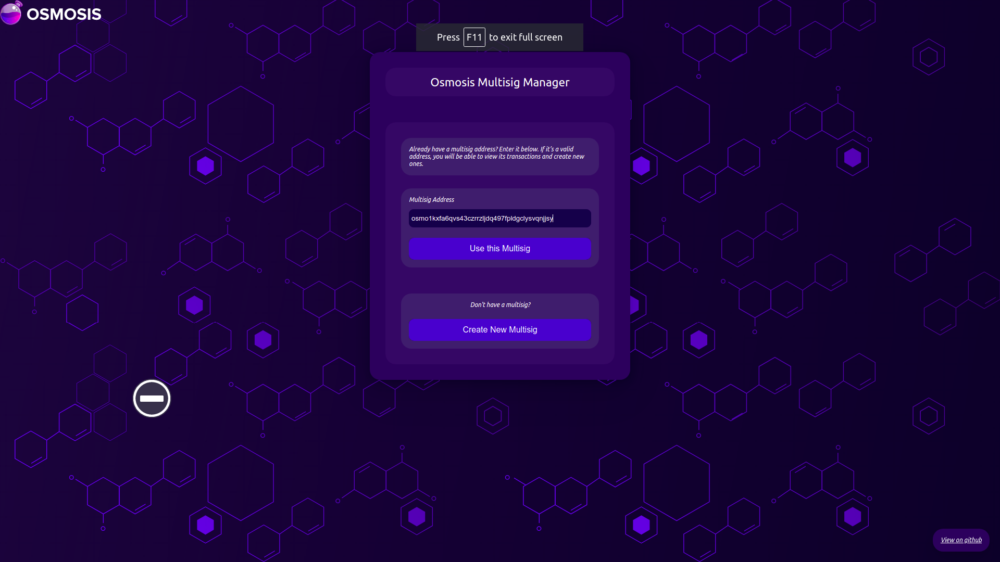

You may want to [Create a Transaction](#creating-a-transaction) next.

### Creating a new multisig account

To create a new multisig account, click the "Create New Multisig" button on the app's homepage. Then enter in the addresses of the accounts you would like to use, as well as the number of signatures required to sign a transaction. Click "Create Multisig". These addresses must have sent transactions in the past to be used, the app will show an error if there is no on chain account information for any of the addresses.

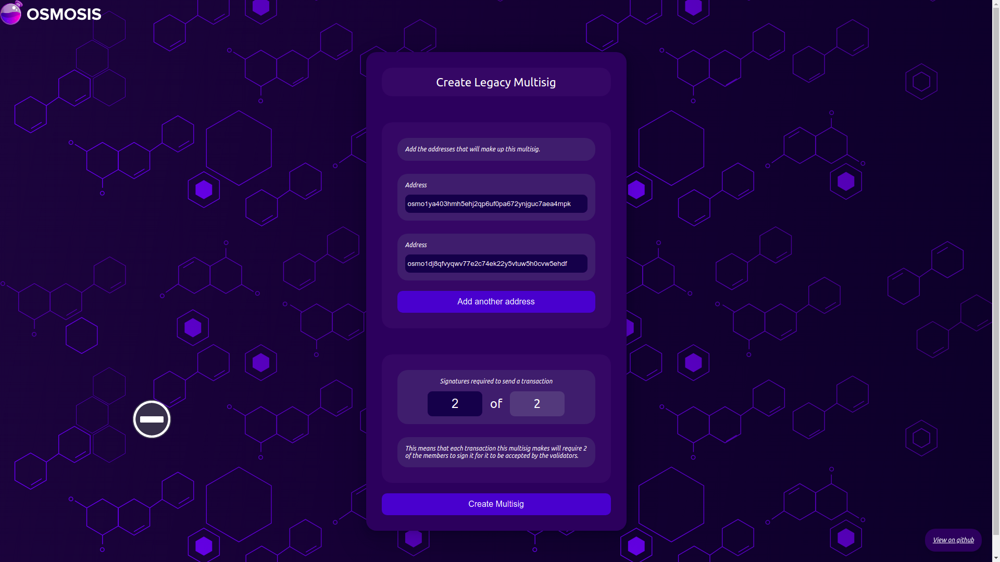

You may want to [Create a Transaction](#creating-a-transaction) next.

## Creating a Transaction

On the multisig account page, click "Create Transaction". 

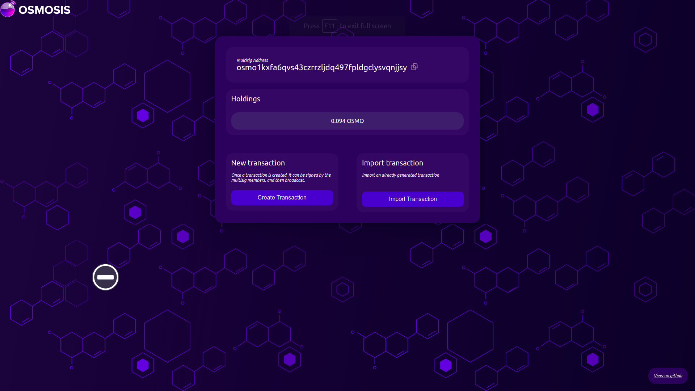
Enter in the to address, the amount and optionally a memo. The gas limit is adjustable, but you probably do not want to change it, as the gas fees are set automatically by the app. Once all the necessary fields are filled in, click "Create Transaction". 
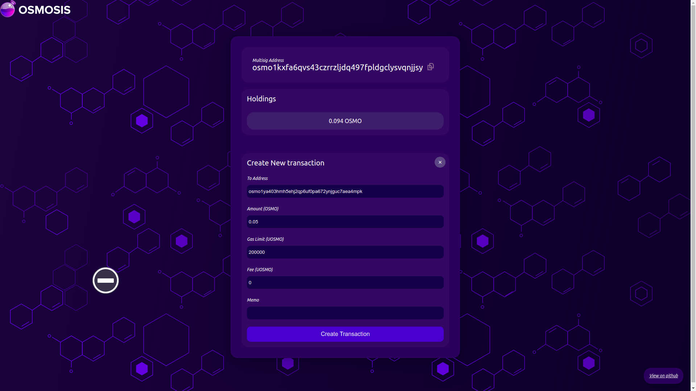

You may want to [Sign a Transaction](#signing-a-transaction) or [Importing a Signature](#importing-a-signature) next.

## Importing a Transaction

On the multisig account page, click "Import Transaction". 

Paste in the transaction generated by other tools (Ex: Keplr, CLI). Click "Import Transaction" to import transaction.
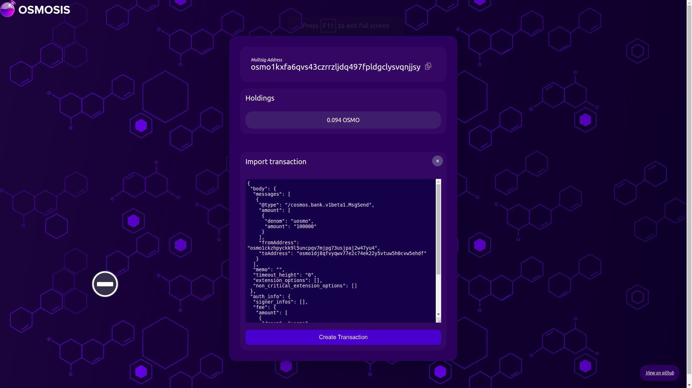

You may want to [Sign a Transaction](#signing-a-transaction) or [Importing a Signature](#importing-a-signature) next.

## Signing a Transaction

To sign a transaction, make sure you have the Keplr wallet app installed and setup on your browser. Then navigate to the transaction page for the transaction you are trying to sign.  

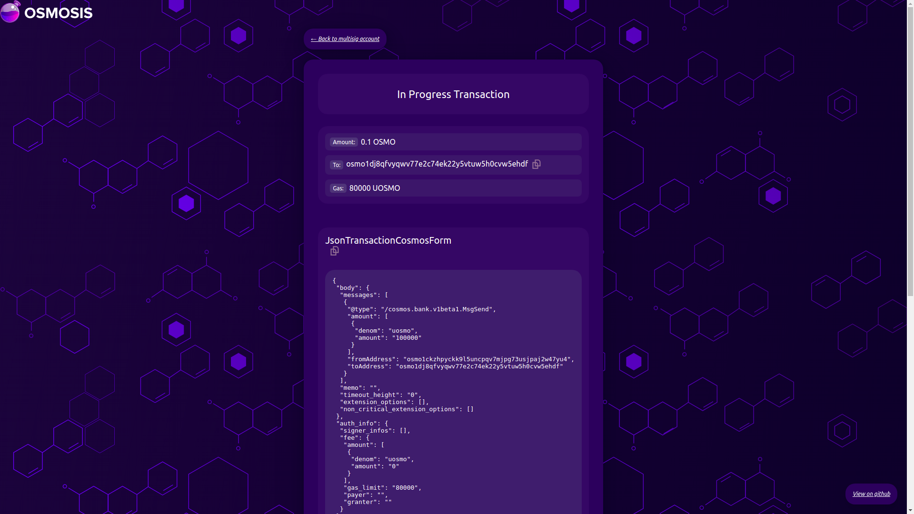

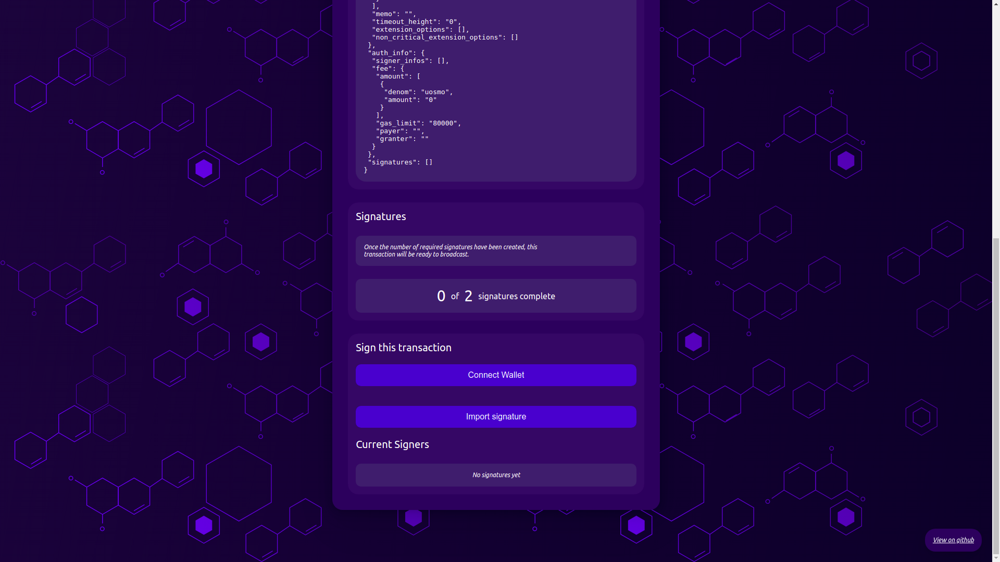

Click "Connect Wallet" and then "Sign Transaction". Approve the transaction in the Keplr window that pops up. That's it! Once you've successfully signed a transaction, you will see a confirmation message.

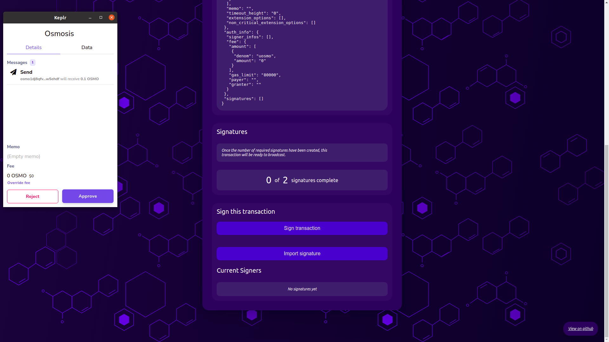

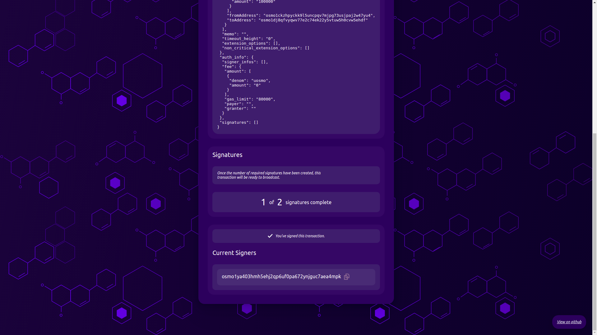

Once enough necessary signers have signed, anyone will be able to [broadcast the transaction](#broadcasting-a-transaction).

## Importing a Signature

Allow you to sign your transaction on local cli.

Copy transaction in JsonTransactionCosmosForm to a file. Sign it with your local cli.

Click "Import Signature" then paste your signature generated by your CLI. Click "Submit Signature" to submit signature.

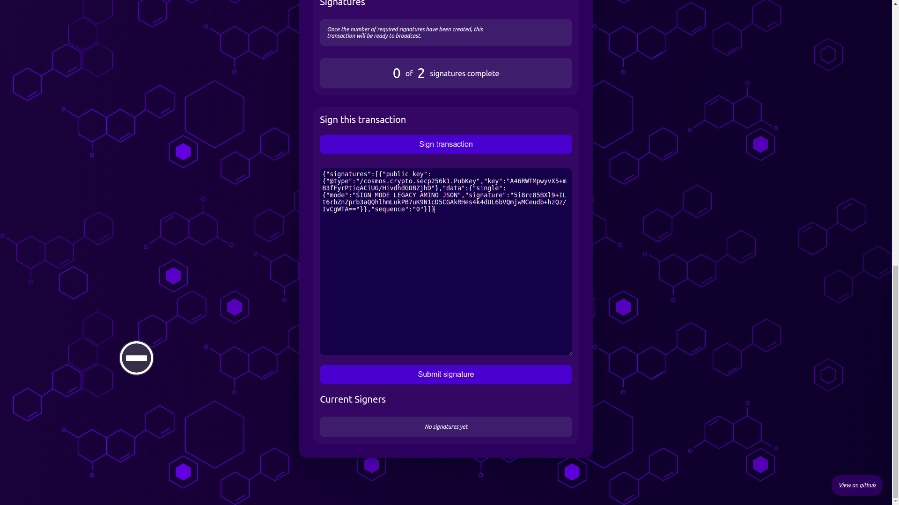

## Broadcasting a Transaction

Once enough signers have signed a transaction, the transaction will become broadcastable. To broadcast, click "Broadcast Transaction". 

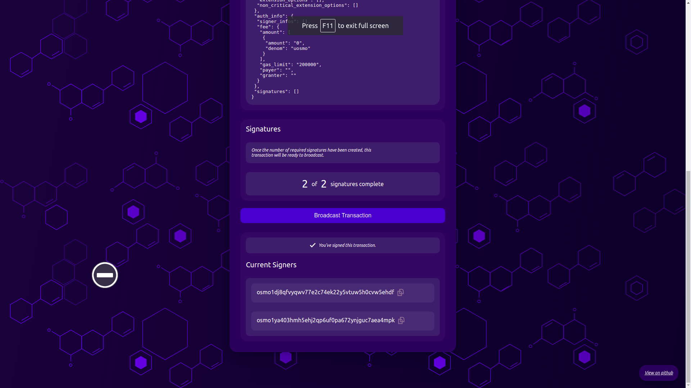

Once successfully broadcast, the app will show a success message and will give you a link to view the transaction on mintscan. If the transaction could not be broadcast, the error will appear under the broadcast button.

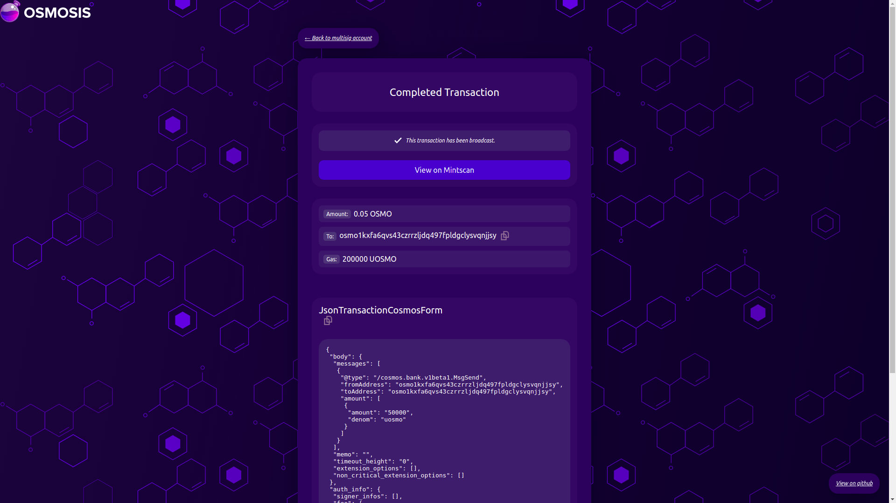

